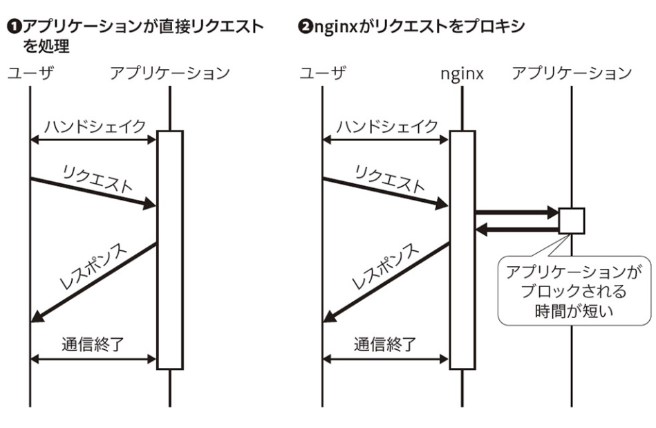

# Nginx

httpサーバー

複数のモジュールを組み合わせた設定

それらモジュールの動作をnginx.confに記述

# C10K問題

1台のサーバーが1万のクライアント(10KのClient)からの接続を同時処理しようとするとサーバーの処理が追いつかなくなるスケーラビリティの問題

1接続1プロセスで大量にプロセスを起動するとプロセス間コンテキストスイッチのオーバーヘッドが大きくなって性能が劣化する

## コンテキストスイッチ

複数プロセスがCPUを共有できるように、CPUの状態を保存したり復元したりする過程のこと

# I/O Multiplexing

複数ファイルディスクラプタを監視し、どれかが入出力可能になるまでプログラムを待機させる手法

# プロキシ

英語で "代理人" という意味

クライアントからサーバへのリクエストを、そのクライアントの代わりに行ってくれるサーバのこと (**リクエストを"する側"の代理人**)

インターネットに繋ぐのに間に入ってIPの変換してくれたり、ブラックリストでリクエストする前にアクセスを弾いてくれたりするやつ

## リバースプロキシ

リクエストを受ける立場である WEB サーバにアクセスする前にこいつを経由するように置かれる(**リクエストを"受ける側"の代理人**)

nginxがプロキシサーバとしてリクエスト・レスポンスをバッファリングすることでアプリケーションのブロック時間を最小化できる。

