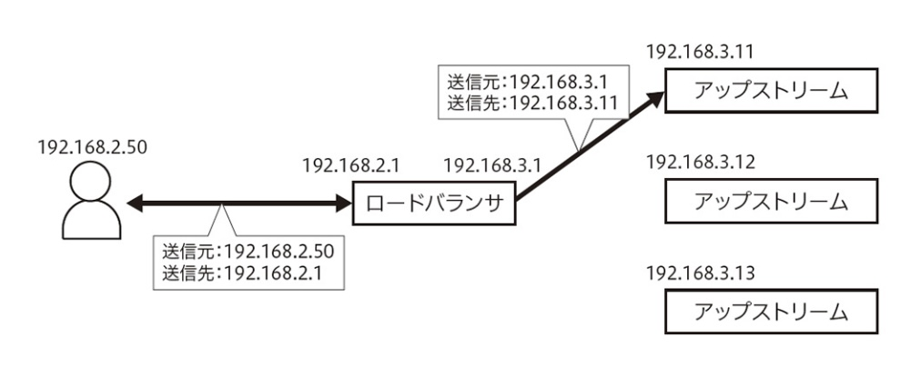

# L4ロードバランサー

TCPレベルで分散を行う

## NAT方式

パケットはすべてロードバランサを経由する



## DSR方式

帰りのパケットはロードバランサを経由しない


# L7ロードバランサー

HTTPレベルで分散を行う


# config

```
upstream app {
	server xxx.xxx.xxx.xxx:80 weight=2;
	server yyy.yyy.yyy.yyy:80 weight=1;
	server zzz.zzz.zzz.zzz:80 weight=1;
}
```

### weight

アップストリームサーバの重みづけ

weightが1, 2, 3だったら、1に指定されるサーバーには1/6のリクエストが振られる

### backup

バックアップサーバー

それ以外の全てのサーバがアップストリームサーバリストから外された時に使用される。

アップストリームサーバリストからサーバが外されるのは、max_failsやfail_timeoutを指定すると、問題があった場合にリストから外される。

```
upstream app {
	server xxx.xxx.xxx.xxx:80;
	server yyy.yyy.yyy.yyy:80 backup;
}
```

### Round-Robin

アプリケーションへのリクエストを上から順に分配

```
http {
	upstream app {
		server xxx.xxx.com;
		server yyy.yyy.com;
		server zzz.zzz.com;
	}
	server {
		listen 80;
		location / {
			proxy_pass https://xyz.xyz;
		}
	}
}
```

### Least-Connected

アクティブなコネクション数が最も少ないサーバに割り当て

```
http {
	upstream app {
		least_conn;
		server xxx.xxx.com;
		server yyy.yyy.com;
		server zzz.zzz.com;
	}
	server {
		listen 80;
		location / {
			proxy_pass https://xyz.xyz;
		}
	}
}
```